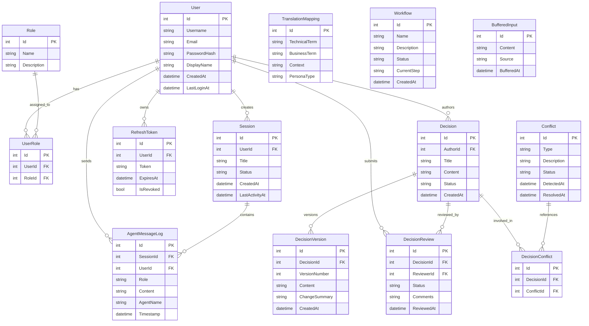

# bmadServer — Data Model

## Entity Relationship Diagram

## Entities (23 DbSet Types + 1 Non-DbSet Entity + 4 Enums)

### Core Entities (Data/Entities/)

| Entity | File | Purpose | Key Fields |
|---|---|---|---|
| `User` | `Data/Entities/User.cs` | User accounts | Id, Username, Email, PasswordHash, DisplayName |
| `Role` | `Data/Entities/Role.cs` | RBAC roles (no DbSet) | Id, Name, Description |
| `UserRole` | `Data/Entities/UserRole.cs` | User-role junction | UserId, RoleId |
| `Session` | `Data/Entities/Session.cs` | Chat sessions | Id, UserId, Title, Status, CreatedAt |
| `RefreshToken` | `Data/Entities/RefreshToken.cs` | JWT refresh tokens | Id, UserId, Token, ExpiresAt, IsRevoked |

### Decision Tracking Entities (Data/Entities/)

| Entity | File | Purpose | Key Fields |
|---|---|---|---|
| `Decision` | `Data/Entities/Decision.cs` | Tracked decisions | Id, AuthorId, Title, Content, Status |
| `DecisionVersion` | `Data/Entities/DecisionVersion.cs` | Decision history | Id, DecisionId, VersionNumber, Content |
| `DecisionReview` | `Data/Entities/DecisionReview.cs` | Decision reviews | Id, DecisionId, ReviewerId, Status, Comments |
| `DecisionReviewResponse` | `Data/Entities/DecisionReview.cs` | Review responses | Id, ReviewId, Response |
| `Conflict` | `Data/Entities/Conflict.cs` | Detected conflicts | Id, Type, Description, Status, DetectedAt |
| `DecisionConflict` | `Data/Entities/DecisionConflict.cs` | Decision-conflict junction | DecisionId, ConflictId |
| `ConflictRule` | `Models/Workflows/ConflictRule.cs` | Conflict detection rules | Id, Pattern, Severity |

### Communication Entities (Data/Entities/)

| Entity | File | Purpose | Key Fields |
|---|---|---|---|
| `AgentMessageLog` | `Data/Entities/AgentMessageLog.cs` | Chat message history | Id, SessionId, Role, Content, AgentName |
| `TranslationMapping` | `Data/Entities/TranslationMapping.cs` | Term translation | TechnicalTerm, BusinessTerm, PersonaType |
| `BufferedInput` | `Data/Entities/BufferedInput.cs` | Input buffering | Id, Content, Source, BufferedAt |

### Workflow Entities (Models/Workflows/)

| Entity | File | Purpose | Key Fields |
|---|---|---|---|
| `Workflow` | `Data/Entities/Workflow.cs` | Workflow definitions | Id, Name, Status, CurrentStep |
| `WorkflowInstance` | `Models/Workflows/WorkflowInstance.cs` | Running workflow instances | Id, WorkflowId, Status, StartedAt |
| `WorkflowEvent` | `Models/Workflows/WorkflowEvent.cs` | Workflow event log | Id, InstanceId, EventType, Timestamp |
| `WorkflowStepHistory` | `Models/Workflows/WorkflowStepHistory.cs` | Step execution history | Id, InstanceId, StepName, CompletedAt |
| `WorkflowParticipant` | `Models/Workflows/WorkflowParticipant.cs` | Workflow participants | Id, InstanceId, UserId, Role |
| `WorkflowCheckpoint` | `Models/Workflows/WorkflowCheckpoint.cs` | Workflow save points | Id, InstanceId, State, CreatedAt |
| `QueuedInput` | `Models/Workflows/QueuedInput.cs` | Queued workflow inputs | Id, Content, Priority, QueuedAt |
| `AgentHandoff` | `Models/Workflows/AgentHandoff.cs` | Agent-to-agent handoffs | Id, FromAgent, ToAgent, Context |
| `ApprovalRequest` | `Models/Workflows/ApprovalRequest.cs` | Approval workflow requests | Id, RequesterId, Status, CreatedAt |

### Enumerations

| Enum | File | Values |
|---|---|---|
| `PersonaType` | `Data/Entities/PersonaType.cs` | `Technical`, `Business` (inferred) |
| `ApprovalStatus` | `Models/Workflows/ApprovalStatus.cs` | Approval states |
| `ParticipantRole` | `Models/Workflows/ParticipantRole.cs` | Workflow participant roles |
| `WorkflowStatus` | `Models/Workflows/WorkflowStatus.cs` | Workflow lifecycle states |

## DbContext

**Class:** `ApplicationDbContext`
**File:** `Data/ApplicationDbContext.cs`
**DbSets:** 23 entity types registered in `ApplicationDbContext` (13 from `Data/Entities/`, 10 from `Models/Workflows/`)

## DTOs

Located in `DTOs/` directory — 20+ Data Transfer Objects for API request/response mapping.

Key DTO patterns:
- `CreateXxxRequest` / `UpdateXxxRequest` — Input DTOs
- `XxxResponse` — Output DTOs
- Validated by FluentValidation (`RegisterRequestValidator`, `LoginRequestValidator`, etc.)

## Migration History

EF Core code-first migrations are stored in `Migrations/` directory. Key milestones:
- Initial schema creation (User, Role, Session)
- Decision tracking entities (Decision, DecisionVersion, DecisionReview)
- Conflict detection entities (Conflict, DecisionConflict)
- Translation and workflow entities
- Agent message logging (AgentMessageLog)

**[UNVERIFIED]** Exact migration count and names — would require listing migration files.

## Gaps & Unknowns

- **[UNVERIFIED]** Exact field types and constraints — entity files not fully inspected
- **[UNKNOWN]** Indexes and unique constraints beyond primary keys
- **[UNKNOWN]** Cascade delete behavior configuration
- **[UNKNOWN]** Soft delete vs hard delete patterns
- **[UNKNOWN]** Audit trail implementation beyond AgentMessageLog
