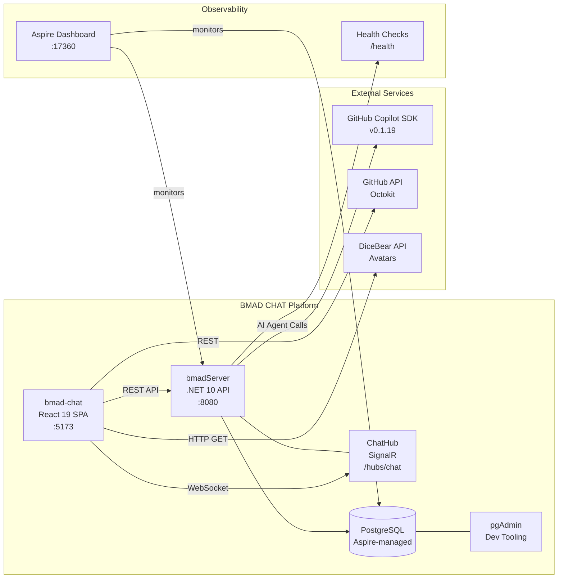

# bmadServer — Integration Map

## Integration Diagram



## Service Dependencies

### Internal Dependencies

| From | To | Protocol | Purpose | Evidence |
|---|---|---|---|---|
| bmad-chat | bmadServer API | HTTP/REST | Chat, Auth, Decisions, Workflows | `src/lib/services/*.ts` |
| bmad-chat | ChatHub | WebSocket (SignalR) | Real-time messaging, presence | `use-collaboration.ts` |
| bmadServer | PostgreSQL | TCP (Npgsql) | Data persistence | `ApplicationDbContext.cs` |
| bmadServer | ChatHub | In-process | SignalR hub broadcasting | `Hubs/ChatHub.cs` |

### External Service Integrations

| Service | Protocol | Auth | Purpose | Evidence |
|---|---|---|---|---|
| GitHub Copilot SDK | SDK (HTTP) | API Key/Token | AI agent chat completion | `CopilotTestService.cs`, `CopilotTestController.cs` |
| GitHub API | REST (Octokit) | OAuth token | GitHub platform integration | `@octokit/core` in bmad-chat `package.json` |
| DiceBear API | HTTP GET | None | Avatar image generation | `src/lib/auth.ts` in bmad-chat |

### Infrastructure Services

| Service | Role | Configuration | Evidence |
|---|---|---|---|
| PostgreSQL | Primary database | Aspire `AddPostgres("pgsql")` | `AppHost.cs` |
| pgAdmin | Database dev tooling | `WithPgAdmin()` | `AppHost.cs` |
| Aspire Dashboard | Observability | Built-in at `:17360` | Aspire default |
| Health Checks | Liveness/readiness | `/health` endpoint | `WithHttpHealthCheck("/health")` |

## Aspire Orchestration Topology

```mermaid
graph TB
    subgraph "AppHost Orchestration"
        AH[Aspire AppHost]
        AH --> PG[(PostgreSQL<br/>AddPostgres)]
        AH --> API[bmadServer.ApiService<br/>AddProject]
        AH --> FE[React Frontend<br/>AddViteApp]
        AH --> PGA[pgAdmin<br/>WithPgAdmin]

        PG -->|Service Discovery| API
        API -->|Reference| FE
        API -->|Health Check| HC[/health]
    end
```

### Deployment Modes

| Mode | PostgreSQL | pgAdmin | Frontend | Evidence |
|---|---|---|---|---|
| Development | ✅ Container | ✅ Enabled | ✅ Vite dev server | Default AppHost |
| Test | ✅ Container | ❌ Disabled | ❌ Disabled | Test mode flag |
| Production | ✅ Managed | ❌ Disabled | ✅ Built static | (inferred) |

## Database Connections

| Connection | Database | Provider | Pool Size | Evidence |
|---|---|---|---|---|
| `pgsql` | PostgreSQL | `Npgsql.EntityFrameworkCore.PostgreSQL` | Default (100) | Aspire service discovery |

## SignalR Events (Real-time)

| Event | Direction | Trigger | Subscribers |
|---|---|---|---|
| `MessageReceived` | Server → Clients | New message sent | All session participants |
| `PresenceEvent` | Server → Clients | User join/leave/typing | All session participants |
| `StepChanged` | Server → Clients | Workflow step execution | Workflow watchers |
| `ConflictDetected` | Server → Clients | Conflict detection job | Decision stakeholders |

## Background Services

| Service | Schedule | Purpose | Evidence |
|---|---|---|---|
| `ConflictEscalationJob` | Timed (periodic) | Escalate unresolved conflicts | `BackgroundServices/ConflictEscalationJob.cs` |
| `SessionCleanupService` | Timed (periodic) | Clean up stale sessions | `BackgroundServices/SessionCleanupService.cs` |

## Cross-Repo Dependencies

| This Repo | Depends On | Relationship | Evidence |
|---|---|---|---|
| bmadServer | bmad-chat | Frontend consumer | Same CHAT domain |
| bmad-chat | bmadServer | Backend provider | Service layer calls |
| bmadServer | BMAD.Lens | Framework source (indirect) | BMAD agent definitions used |

## Resilience Patterns

| Pattern | Implementation | Target | Evidence |
|---|---|---|---|
| Circuit Breaker | Polly `AgentCallPolicy` | Copilot SDK calls | `Infrastructure/Policies/AgentCallPolicy.cs` |
| Rate Limiting | `AspNetCoreRateLimit` | All API endpoints | `AspNetCoreRateLimit` v5.0.0 in `.csproj` |
| Request Validation | FluentValidation | All input DTOs | `FluentValidation.AspNetCore` |

## Gaps & Unknowns

- **[UNKNOWN]** Copilot SDK exact endpoint URLs and auth mechanism
- **[UNKNOWN]** SignalR backplane for multi-instance scaling (Redis, Azure SignalR?)
- **[UNKNOWN]** PostgreSQL connection string details (host, port, SSL)
- **[UNKNOWN]** CORS configuration for bmad-chat → bmadServer communication
