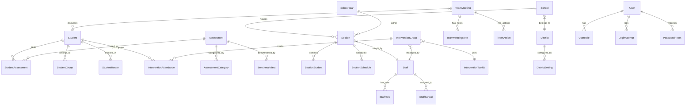
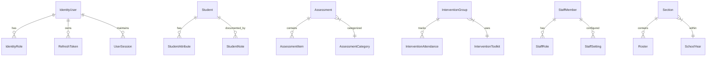

# NorthStarET — Data Model

## Overview

NorthStarET has two parallel data models:
- **Upgrade Track:** EF6 with SQL Server — 104 entities across 2 DbContexts
- **Migration Track:** EF Core with PostgreSQL — 27 entities across 7 service-specific contexts

## Upgrade Track — Entity Relationship Diagram (Core Domains)



## Upgrade Track: EF6 Entities (104 Total)

### DistrictContext — 60 DbSets

**File:** `NorthStar.EF6/DistrictContext.cs`

| Domain | Entity Count | Key Entities |
|---|---|---|
| Student | 8+ | Student, StudentAssessment, StudentGroup, StudentRoster, StudentNote |
| Assessment | 8+ | Assessment, AssessmentCategory, BenchmarkTest, ProbeItem, AssessmentAvailability |
| Intervention | 6+ | InterventionGroup, InterventionAttendance, InterventionToolkit, InterventionGoal |
| Section | 6+ | Section, SectionStudent, SectionSchedule, SectionReport |
| Staff | 4+ | Staff, StaffRole, StaffSchool, StaffSetting |
| Team Meeting | 4+ | TeamMeeting, TeamMeetingNote, TeamAction, TeamStudent |
| District Admin | 6+ | DistrictSetting, School, SchoolYear, Calendar, Grade, ReportTemplate |
| Data/Reporting | 8+ | DataEntry, ExportJob, FilterOption, GraphData, PrintJob |
| Other | 10+ | AuditLog, FileUpload, Video, Notification, BatchJob |

### LoginContext — 44 DbSets

**File:** `NorthStar.EF6/LoginContext.cs`

| Domain | Entity Count | Key Entities |
|---|---|---|
| Auth | 6+ | User, UserRole, LoginAttempt, PasswordReset, Session, Token |
| Multi-tenant | 8+ | District, DistrictUser, DistrictApplication, License |
| Legacy | 30+ | Various legacy entities for cross-district user management |

## Migration Track: Clean Architecture Entities (27 Total)



### By Service

| Service | Entities | Path | Database |
|---|---|---|---|
| **Identity** | IdentityUser, IdentityRole, UserClaim, RefreshToken, UserSession, AuditLog | `Identity/Identity.Domain/Entities/` | shared |
| **StudentService** | Student, StudentAttribute, StudentNote, StudentRoster, Guardian, EmergencyContact | `StudentService/Domain/Entities/` | student-db |
| **AssessmentService** | Assessment, AssessmentItem, AssessmentCategory | `AssessmentService/Domain/Entities/` | shared |
| **AssessmentManagement** | Benchmark | `AssessmentManagement/Domain/Entities/` | shared |
| **InterventionService** | InterventionGroup, InterventionAttendance, InterventionToolkit, InterventionGoal | `InterventionService.Domain/Entities/` | intervention-db |
| **StaffManagement** | StaffMember, StaffRole, StaffSchool, StaffSetting | `NorthStar.Staff.Domain/Entities/` | staff-db |
| **SectionService** | Section, Roster, RolloverConfig | `SectionService.Domain/Entities/` | section-db |

## DTO Layer

### Upgrade Track
Located in `EntityDto/DTO/Admin/`:

| DTO Domain | Path | Pattern |
|---|---|---|
| District | `DTO/Admin/District/` | Input/Output DTO pairs |
| InterventionGroup | `DTO/Admin/InterventionGroup/` | Input/Output DTO pairs |
| InterventionToolkit | `DTO/Admin/InterventionToolkit/` | Input/Output DTO pairs |
| Section | `DTO/Admin/Section/` | Input/Output DTO pairs |
| Simple (Common) | `DTO/Admin/Simple/` | Shared/common DTOs |
| StackedBarGraph | `DTO/Admin/StackedBarGraph/` | Chart DTOs |
| Student | `DTO/Admin/Student/` | Input/Output DTO pairs |
| TeamMeeting | `DTO/Admin/TeamMeeting/` | Input/Output DTO pairs |

### Migration Track
Each service defines DTOs in its API layer:

```
{Service}/Api/DTOs/
  ├── Create{Entity}Request.cs
  ├── Update{Entity}Request.cs
  └── {Entity}Response.cs
```

## Custom DataAccess Library

**Path:** `DataAccess/`
**Purpose:** Bespoke `DataTable` library for tabular data manipulation (20 files)
**Key Classes:** `DataTable.cs`, `DataTableBuilder.cs`, `CsvWriter.cs`
**Note:** This is a custom library, NOT `System.Data.DataTable` — used for tabular report generation.

## Migration Progress (Data Model)

| Domain | EF6 Entities | EF Core Entities | Coverage |
|---|---|---|---|
| Identity/Auth | 6+ | 6 | ~100% |
| Student | 8+ | 6 | ~75% |
| Assessment | 8+ | 4 | ~50% |
| Intervention | 6+ | 4 | ~67% |
| Section | 6+ | 3 | ~50% |
| Staff | 4+ | 4 | ~100% |
| Team Meeting | 4+ | 0 | 0% |
| District Admin | 6+ | 0 | 0% |
| Reporting | 8+ | 0 | 0% |
| **Total** | **104** | **27** | **~26%** |

## Gaps & Unknowns

- **[UNVERIFIED]** Exact entity field definitions — would require reading each entity file
- **[UNKNOWN]** EF6 migration history (no code-first migrations; likely database-first)
- **[UNKNOWN]** Foreign key cascade behavior in EF Core services
- **[UNKNOWN]** Cross-service data consistency patterns (saga, eventual consistency?)
- **[NOTE]** EF6 entities are not documented in the repo — inferred from DbContext DbSet declarations
