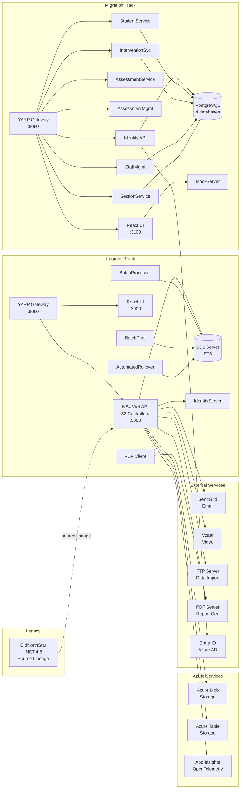

# NorthStarET — Integration Map

## Integration Diagram

## External Service Integrations

### Azure Services

| Service | Protocol | Auth | Purpose | Evidence |
|---|---|---|---|---|
| Azure Blob Storage | REST (Azure SDK) | Connection string | Document/file storage | AppHost `BlobStorage` parameter |
| Azure Table Storage | REST (Azure SDK) | Connection string | Structured data | AppHost `TableStorage` parameter |
| Application Insights | OpenTelemetry | Connection string | Monitoring + tracing | AppHost `ApplicationInsightsConnectionString` |

### Third-Party Services

| Service | Protocol | Auth | Purpose | Evidence |
|---|---|---|---|---|
| SendGrid | REST API | API key | Email notifications | AppHost `SendGridApiKey`, `SendGridUser`, `SendGridPassword` |
| Vzaar | REST API | Token + Secret | Video hosting/streaming | AppHost `VzaarToken`, `VzaarSecret` |
| FTP Server | FTP | Username + Password | Data import/export (bulk) | AppHost `FtpSite`, `FtpUsername`, `FtpPassword` |
| PDF Server | HTTP + FTP | Key + Credentials | Report generation | AppHost `PdfKey`, `PdfServerIp`, `PdfServerPort`, `PdfUserName`, `PdfPassword` |
| Entra ID (Azure AD) | OIDC | OAuth | Migration track auth | `EntraAuthController` |

## Internal Service Dependencies

### Upgrade Track

| From | To | Type | Purpose |
|---|---|---|---|
| YARP Gateway | NS4.WebAPI | HTTP reverse proxy | API routing (`/api/{**catch-all}`) |
| YARP Gateway | React UI | HTTP reverse proxy | SPA serving |
| NS4.WebAPI | SQL Server (DistrictContext) | TCP/SQL | 60-entity educational data |
| NS4.WebAPI | SQL Server (LoginContext) | TCP/SQL | 44-entity auth data |
| NS4.WebAPI | IdentityServer | HTTP | Token validation |
| BatchProcessor | SQL Server | TCP/SQL | Background data processing |
| BatchPrint | SQL Server | TCP/SQL | Report generation |
| AutomatedRollover | SQL Server | TCP/SQL | Year-end roster rollover |
| WnvHtmlToPdfClient | PDF Server | HTTP + FTP | PDF generation |

### Migration Track

| From | To | Type | Purpose |
|---|---|---|---|
| YARP Gateway | Identity.API | HTTP proxy | `/identity/*` |
| YARP Gateway | StudentService | HTTP proxy | `/students/*` |
| YARP Gateway | AssessmentService | HTTP proxy | `/api/assessments/*` |
| YARP Gateway | AssessmentManagement | HTTP proxy | `/api/benchmarks/*` |
| YARP Gateway | InterventionService | HTTP proxy | `/api/intervention-*/*` |
| YARP Gateway | StaffManagement | HTTP proxy | `/api/staff/*` |
| YARP Gateway | SectionService | HTTP proxy | `/api/sections/*` |
| YARP Gateway | MockServer | HTTP proxy | `/api/students/*` (dev) |
| Identity.API | Entra ID | OIDC | Azure AD authentication |
| StudentService | student-db (PostgreSQL) | TCP/Npgsql | Student data |
| InterventionService | intervention-db (PostgreSQL) | TCP/Npgsql | Intervention data |
| StaffManagement | staff-db (PostgreSQL) | TCP/Npgsql | Staff data |
| SectionService | section-db (PostgreSQL) | TCP/Npgsql | Section data |

## Database Connections

### Upgrade Track

| Context | Database | Provider | Entities |
|---|---|---|---|
| `DistrictContext` | SQL Server | Entity Framework 6 | 60 |
| `LoginContext` | SQL Server | Entity Framework 6 | 44 |

### Migration Track

| Service | Database | Provider | Entities |
|---|---|---|---|
| StudentService | student-db | Npgsql/EF Core | 6 |
| InterventionService | intervention-db | Npgsql/EF Core | 4 |
| StaffManagement | staff-db | Npgsql/EF Core | 4 |
| SectionService | section-db | Npgsql/EF Core | 3 |

## Cross-Repo Dependencies

| This Repo | Related Repo | Relationship |
|---|---|---|
| NorthStarET | OldNorthStar | Source lineage — modernizing from this codebase |
| NorthStarET | NorthStarET.Student | Planned student portal consumer |
| NorthStarET (in `.referenceSrc/`) | OldNorthStar | Embedded reference copy for parity testing |

## Secret Management

**18+ secrets managed via Aspire `AddParameter(secret: true)`:**

| Category | Parameters |
|---|---|
| Database | `LoginConnection` |
| Azure Storage | `BlobStorage`, `WebJobsStorage`, `WebJobsDashboard`, `TableStorage` |
| Telemetry | `ApplicationInsightsConnectionString` |
| Video | `VzaarToken`, `VzaarSecret` |
| Email | `SendGridApiKey`, `SendGridUser`, `SendGridPassword` |
| PDF | `PdfKey`, `PdfUserName`, `PdfPassword`, `PdfServerIp`, `PdfServerPort` |
| FTP | `FtpSite`, `FtpUsername`, `FtpPassword` |
| Admin | `RolloverEmail`, `AdminEmail`, `RebexKey`, `DistrictId` |

**Risk:** All secrets are Aspire parameters — should be migrated to Azure Key Vault with managed identities.

## Dual-Track Coexistence

Both tracks run simultaneously via separate Aspire AppHosts:

| Aspect | Upgrade Track | Migration Track |
|---|---|---|
| Gateway Port | 8080 | 8080 (separate instance) |
| API Port | 5000 | Various (per service) |
| Frontend Port | 3000 | 3100 |
| Database | SQL Server | PostgreSQL |
| AppHost | `Upgrade/Backend/NorthStarET.AppHost/` | `Migration/Backend/AppHost/` |

## Gaps & Unknowns

- **[UNKNOWN]** Cross-service communication patterns between microservices (sync vs async)
- **[UNKNOWN]** Data replication strategy between SQL Server and PostgreSQL
- **[UNKNOWN]** Service mesh or API gateway auth propagation
- **[UNKNOWN]** Queue/event bus integration (if any)
- **[UNKNOWN]** CDN configuration for static assets
