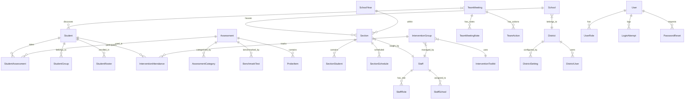

# OldNorthStar — Data Model

## Overview

OldNorthStar uses Entity Framework 6 with SQL Server, containing **104 total entities** across 2 DbContexts. This is the same data model carried forward to the NorthStarET Upgrade track.

## Entity Relationship Diagram (Core Domains)

## DistrictContext — 60 DbSets

**File:** `NorthStar.EF6/DistrictContext.cs`

### Student Entities

| Entity | Purpose | Key Fields (inferred) |
|---|---|---|
| `Student` | Student records | Id, FirstName, LastName, Grade, SchoolId |
| `StudentAssessment` | Student-assessment junction | StudentId, AssessmentId, Score, Date |
| `StudentGroup` | Student-group membership | StudentId, GroupId |
| `StudentRoster` | Enrollment records | StudentId, SectionId, SchoolYear |
| `StudentNote` | Notes on students | StudentId, Content, StaffId, Date |
| `StudentDashboard` | Dashboard metrics | StudentId, MetricType, Value |
| `StudentAttribute` | Custom attributes | StudentId, Key, Value |
| `StudentHistory` | Historical records | StudentId, Event, Date |

### Assessment Entities

| Entity | Purpose | Key Fields (inferred) |
|---|---|---|
| `Assessment` | Assessment definitions | Id, Name, Type, Category |
| `AssessmentCategory` | Assessment categorization | Id, Name |
| `AssessmentAvailability` | Assessment windows | AssessmentId, StartDate, EndDate |
| `BenchmarkTest` | Benchmark definitions | Id, Name, AssessmentId |
| `ProbeItem` | Probe test items | Id, ProbeId, Content |
| `DataEntry` | Data entry records | Id, Type, Data, Date |
| `ScoreScale` | Scoring scales | Id, Name, Min, Max |
| `GradeLevel` | Grade level definitions | Id, Name, Order |

### Intervention Entities

| Entity | Purpose | Key Fields (inferred) |
|---|---|---|
| `InterventionGroup` | Intervention group definitions | Id, Name, ToolkitId, StaffId |
| `InterventionAttendance` | Session attendance | GroupId, StudentId, Date, Present |
| `InterventionToolkit` | Toolkit definitions | Id, Name, Description |
| `InterventionGoal` | Goals per student/group | Id, GroupId, StudentId, Goal |
| `InterventionSession` | Session records | Id, GroupId, Date, Notes |
| `InterventionProgress` | Progress tracking | StudentId, MetricId, Value |

### Section/Classroom Entities

| Entity | Purpose | Key Fields (inferred) |
|---|---|---|
| `Section` | Class section definitions | Id, Name, StaffId, SchoolId |
| `SectionStudent` | Section enrollment | SectionId, StudentId |
| `SectionSchedule` | Section schedule | SectionId, DayOfWeek, Time |
| `SectionReport` | Section report configs | SectionId, ReportType |

### Staff Entities

| Entity | Purpose | Key Fields (inferred) |
|---|---|---|
| `Staff` | Staff records | Id, FirstName, LastName, Email, SchoolId |
| `StaffRole` | Staff role assignments | StaffId, Role |
| `StaffSchool` | Staff-school assignments | StaffId, SchoolId |
| `StaffSetting` | Staff preferences | StaffId, Key, Value |

### Team Meeting Entities

| Entity | Purpose | Key Fields (inferred) |
|---|---|---|
| `TeamMeeting` | Meeting records | Id, Date, Title, Type |
| `TeamMeetingNote` | Meeting notes | MeetingId, Content, AuthorId |
| `TeamAction` | Action items | MeetingId, Description, AssigneeId, DueDate |
| `TeamStudent` | Students discussed | MeetingId, StudentId |

### District/Admin Entities

| Entity | Purpose | Key Fields (inferred) |
|---|---|---|
| `District` | District records | Id, Name, State |
| `DistrictSetting` | District configuration | DistrictId, Key, Value |
| `School` | School records | Id, Name, DistrictId |
| `SchoolYear` | Academic year definitions | Id, Name, StartDate, EndDate |
| `Calendar` | Calendar events | Id, Date, Type, SchoolId |
| `Grade` | Grade definitions | Id, Name, Order |

### Reporting/Other Entities (~20+ additional)

| Entity | Purpose |
|---|---|
| `ReportTemplate` | Report template definitions |
| `GraphData` | Chart data records |
| `FilterOption` | Search/filter configurations |
| `ExportJob` | Data export job tracking |
| `PrintJob` | Print job tracking |
| `FileUpload` | Uploaded file records |
| `Video` | Video references (Vzaar) |
| `AuditLog` | Audit trail entries |
| `Notification` | User notifications |
| `BatchJob` | Batch processing records |

## LoginContext — 44 DbSets

**File:** `NorthStar.EF6/LoginContext.cs`

### Auth Entities

| Entity | Purpose | Key Fields (inferred) |
|---|---|---|
| `User` | User accounts | Id, Username, Email, PasswordHash |
| `UserRole` | User role assignments | UserId, RoleId |
| `LoginAttempt` | Login audit log | UserId, Timestamp, Success, IpAddress |
| `PasswordReset` | Password reset tokens | UserId, Token, ExpiresAt |
| `Session` | Active sessions | UserId, Token, CreatedAt, ExpiresAt |
| `Token` | Auth tokens | UserId, Value, Type, ExpiresAt |

### Multi-Tenant Entities

| Entity | Purpose | Key Fields (inferred) |
|---|---|---|
| `DistrictUser` | District-user mapping | DistrictId, UserId |
| `DistrictApplication` | District app configs | DistrictId, AppKey, Settings |
| `License` | Licensing records | DistrictId, Type, ExpiresAt |

### Legacy Entities (~35 additional)

Various legacy entities for cross-district user management, application configuration, and platform administration. Exact count: ~35 additional entities bringing the total to 44 DbSets.

## DTO Layer

**Path:** `EntityDto/DTO/Admin/`

| DTO Domain | Directory | Pattern |
|---|---|---|
| District | `DTO/Admin/District/` | Input/Output DTO pairs |
| InterventionGroup | `DTO/Admin/InterventionGroup/` | Input/Output DTO pairs |
| InterventionToolkit | `DTO/Admin/InterventionToolkit/` | Input/Output DTO pairs |
| Section | `DTO/Admin/Section/` | Input/Output DTO pairs |
| Simple (Common) | `DTO/Admin/Simple/` | Shared/reusable DTOs |
| StackedBarGraph | `DTO/Admin/StackedBarGraph/` | Chart data DTOs |
| Student | `DTO/Admin/Student/` | Input/Output DTO pairs |
| TeamMeeting | `DTO/Admin/TeamMeeting/` | Input/Output DTO pairs |

## Custom DataAccess Library

**Path:** `DataAccess/` (20 files)

| Class | Purpose |
|---|---|
| `DataTable.cs` | Custom tabular data structure |
| `DataTableBuilder.cs` | Builder pattern for DataTable |
| `CsvWriter.cs` | CSV export |
| `Column.cs` | Column definition |
| `Row.cs` | Row definition |

**Note:** This is NOT `System.Data.DataTable` — it is a bespoke library for tabular report generation and CSV export.

## Migration History

No EF code-first migrations found in the repository. The data model is likely **database-first** — entity models were generated from an existing SQL Server schema. The actual migration scripts live outside this repository (possibly maintained via SQL Server Management Studio or a separate migration tool).

## Lineage

This data model is **identical** to NorthStarET Upgrade track:
- Same 2 DbContexts (`DistrictContext` + `LoginContext`)
- Same 104 total entities (60 + 44)
- Same DTO structure
- Same custom DataAccess library

NorthStarET Migration track has decomposed 27 of 104 entities into 7 domain-specific EF Core contexts.

## Gaps & Unknowns

- **[UNVERIFIED]** Exact entity field definitions — field lists are inferred from domain patterns, not direct file inspection
- **[UNKNOWN]** SQL Server schema details (indexes, constraints, stored procedures)
- **[UNKNOWN]** Data volume and row counts per entity
- **[UNKNOWN]** Multi-tenancy implementation details (per-district schema? row-level filtering?)
- **[UNKNOWN]** Whether database-first or code-first was used originally
- **[NOTE]** 171 files in `NorthStar.EF6/` suggests entity models + mapping configurations
