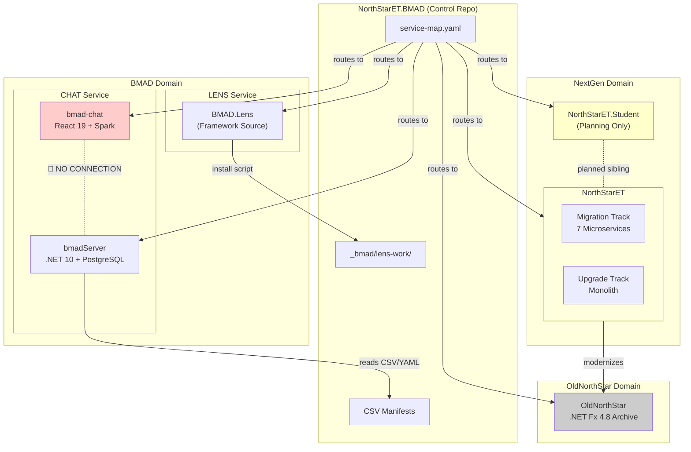

# Architecture Overview — NorthStarET.BMAD Portfolio

## 1. Domain Architecture

The portfolio is organized into **3 domains** containing **6 repositories**, orchestrated by a single control repo.

### Domain Map

```
NorthStarET.BMAD (Control Repo)
│
├── BMAD Domain ─────────────────────────────────────────────────
│   ├── LENS Service
│   │   └── BMAD.Lens (Framework Source)
│   │       • 5 agents, 40 workflows, 26 prompts
│   │       • YAML/MD/JS — no compiled code
│   │       • Dogfooding: source → installed in control repo
│   │
│   └── CHAT Service
│       ├── bmadServer (.NET 10 API)
│       │   • 11 controllers, 40+ endpoints, 23 entities
│       │   • PostgreSQL, SignalR, JWT, Aspire
│       │
│       └── bmad-chat (React 19 SPA)
│           • 20+ components, 7 hooks
│           • GitHub Spark platform (local-only)
│           • ⚠️ NOT CONNECTED to bmadServer
│
├── NextGen Domain ──────────────────────────────────────────────
│   ├── NorthStarET (Main LMS)
│   │   ├── Migration Track: 7 microservices + YARP + React
│   │   ├── Upgrade Track: 34-controller monolith, EF6
│   │   └── AIUpgrade Track: (experimental)
│   │
│   └── NorthStarET.Student (Planning Only)
│       • BMAD bootstrapped, zero code
│
└── OldNorthStar Domain ────────────────────────────────────────
    └── OldNorthStar (Legacy Archive)
        • .NET Fx 4.8, 36 controllers, EF6
        • Read-only reference for modernization
```

## 2. Cross-Repo Dependency Map

### Runtime Dependencies



### Build-Time Dependencies

| From | To | Type | Mechanism |
|------|----|------|-----------|
| NorthStarET.BMAD | BMAD.Lens | Module install | `install-lens-work-relative.ps1` |
| bmadServer.ApiService | bmadServer.ServiceDefaults | Project reference | .NET |
| bmadServer.ApiService | `_bmad/` directory | Runtime file reads | CSV/YAML parsing |
| NorthStarET Migration services | Shared Foundation libraries | Project reference | Common DTOs, auth |
| NorthStarET Upgrade | NorthStar.EF6 | Project reference | EF6 compat layer |

## 3. Communication Patterns

### Protocol Matrix

| Protocol | Where Used | Repos | Notes |
|----------|-----------|-------|-------|
| **REST/HTTP** | API endpoints | bmadServer (40+ endpoints), NorthStarET (50+ endpoints) | Primary API pattern |
| **SignalR/WebSocket** | Real-time chat | bmadServer (`/hubs/chat`) | JWT via query string |
| **YARP Reverse Proxy** | API gateway | NorthStarET Migration (port 8080 → microservices) | Pattern routing |
| **Aspire Service Discovery** | Inter-service | bmadServer, NorthStarET (both tracks) | Auto-configured endpoints |
| **File System** | Agent/workflow loading | bmadServer → `_bmad/` CSV/YAML | Runtime file reads |
| **Spark KV** | Client-side storage | bmad-chat | Browser-local only |
| **Spark LLM** | In-browser AI | bmad-chat (GPT-4o) | Browser-local only |
| **EF Core → PostgreSQL** | Data persistence | bmadServer (1 DB), NorthStarET Migration (4 DBs) | Npgsql provider |
| **EF6 → SQL Server** | Legacy data | NorthStarET Upgrade, OldNorthStar | Legacy pattern |
| **OAuth 2.0/OIDC** | Enterprise auth | NorthStarET Migration (Entra ID) | Identity service |

### Data Flow Diagram

```
┌──────────────────────────────────────────────────────────────────────┐
│                              USERS                                    │
│                                                                       │
│    ┌─────────────┐     ┌──────────────────┐     ┌─────────────┐      │
│    │  bmad-chat   │     │  NorthStarET UI   │     │  Legacy UI   │     │
│    │  (React 19)  │     │  (React 18)       │     │ (AngularJS)  │     │
│    └──────┬───────┘     └────────┬──────────┘     └──────┬───────┘     │
│           │                      │                        │             │
│    ┌──────▼──────┐        ┌──────▼───────┐        ┌──────▼───────┐    │
│    │ Spark KV    │        │ YARP Gateway  │        │   IIS         │    │
│    │ (local only)│        │ (port 8080)   │        │ (legacy)      │    │
│    │ 🔴 no sync  │        └──────┬───────┘        └──────┬───────┘    │
│    └─────────────┘               │                        │             │
│                           ┌──────▼───────┐        ┌──────▼───────┐    │
│    ┌─────────────┐        │ Microservices │        │ OldNorthStar  │    │
│    │ bmadServer   │        │ (7 services)  │        │ (monolith)    │    │
│    │ (.NET 10)    │        └──────┬───────┘        └──────┬───────┘    │
│    └──────┬───────┘               │                        │             │
│           │                ┌──────▼───────┐        ┌──────▼───────┐    │
│    ┌──────▼───────┐        │ PostgreSQL    │        │ SQL Server    │    │
│    │ PostgreSQL    │        │ (4 databases) │        │ (legacy)      │    │
│    │ (bmadserver)  │        │ student-db    │        └───────────────┘    │
│    └───────────────┘        │ intervention  │                             │
│                             │ staff-db      │                             │
│                             │ section-db    │                             │
│                             └───────────────┘                             │
└──────────────────────────────────────────────────────────────────────────┘
```

## 4. Shared Infrastructure

### Common Across Repos

| Infrastructure | bmadServer | NorthStarET | OldNorthStar |
|---------------|-----------|-------------|--------------|
| **.NET Runtime** | .NET 10 | .NET 10 | .NET Fx 4.8 |
| **Aspire** | 13.1 | 13.1 | — |
| **PostgreSQL** | ✅ (1 DB) | ✅ (4 DBs) | — |
| **SQL Server** | — | ✅ (Upgrade) | ✅ |
| **Entity Framework** | EF Core | EF Core + EF6 | EF6 |
| **JWT Auth** | Custom | Custom + Entra | IdentityServer |
| **OpenTelemetry** | ServiceDefaults | ServiceDefaults | — |
| **GitHub Actions** | ✅ | ✅ | — |
| **xUnit** | ✅ | ✅ | — |
| **Playwright** | ✅ | ✅ | — |

### Shared Patterns Not Yet Extracted

| Pattern | Repos | Opportunity |
|---------|-------|------------|
| **JWT Configuration** | bmadServer, NorthStarET | Extract shared auth NuGet package |
| **Aspire ServiceDefaults** | bmadServer, NorthStarET | Potential shared defaults project |
| **PostgreSQL Configuration** | bmadServer, NorthStarET Migration | Common Npgsql configuration |
| **OpenTelemetry Setup** | bmadServer, NorthStarET | Could share tracing configuration |

## 5. Technology Radar

### What's Used Where

| Technology | BMAD.Lens | bmad-chat | bmadServer | NorthStarET | NS.Student | OldNorthStar |
|-----------|-----------|-----------|-----------|-------------|-----------|-------------|
| .NET 10 | — | — | ✅ | ✅ | — | — |
| .NET Fx 4.8 | — | — | — | — | — | ✅ |
| React 19 | — | ✅ | — | — | — | — |
| React 18 | — | — | — | ✅ | — | — |
| AngularJS 1.x | — | — | — | — | — | ✅ |
| TypeScript | — | ✅ | — | ✅ | — | — |
| Aspire | — | — | ✅ | ✅ | — | — |
| PostgreSQL | — | — | ✅ | ✅ | — | — |
| SQL Server | — | — | — | ✅ | — | ✅ |
| EF Core | — | — | ✅ | ✅ | — | — |
| EF6 | — | — | — | ✅ | — | ✅ |
| SignalR | — | — | ✅ | — | — | — |
| YARP | — | — | — | ✅ | — | — |
| JWT | — | — | ✅ | ✅ | — | — |
| Entra ID | — | — | — | ✅ | — | — |
| IdentityServer | — | — | — | — | — | ✅ |
| GitHub Spark | — | ✅ | — | — | — | — |
| Vite | — | ✅ | — | ✅ | — | — |
| Tailwind | — | ✅ | — | — | — | — |
| Node.js | ✅ | ✅ | — | ✅ | — | — |
| YAML/MD | ✅ | — | — | — | ✅ | — |
| FluentValidation | — | — | ✅ | — | — | — |
| Polly | — | — | ✅ | — | — | — |
| Rate Limiting | — | — | ✅ | — | — | — |
| Swagger/OpenAPI | — | — | ✅ | — | — | — |

### Technology Trends

| Trend | Direction | Repos Adopting |
|-------|-----------|---------------|
| **Aspire orchestration** | ↑ Increasing | bmadServer, NorthStarET |
| **PostgreSQL** | ↑ Increasing | bmadServer, NorthStarET Migration |
| **EF Core** | ↑ Increasing | bmadServer, NorthStarET Migration |
| **React 18/19** | ↑ Active | bmad-chat, NorthStarET |
| **SQL Server** | ↓ Decreasing | NorthStarET Upgrade (legacy) |
| **EF6** | ↓ Decreasing | NorthStarET Upgrade (legacy) |
| **.NET Framework** | ↓ End of life | OldNorthStar only |
| **AngularJS** | ✗ Dead | OldNorthStar only |
| **bower** | ✗ Dead | OldNorthStar, NorthStarET Upgrade |

## 6. Cross-Repo Architecture Risks

### Risk 1: bmad-chat ↔ bmadServer Disconnection (CRITICAL)

The CHAT service domain has a frontend (bmad-chat) and backend (bmadServer) that share zero integration. bmad-chat uses GitHub Spark APIs for everything — data, auth, AI. bmadServer has a full API surface waiting for a frontend client.

**Impact:** Two independently operating applications that should be one integrated system.
**Fix:** Replace Spark KV/LLM calls with bmadServer REST + SignalR calls. Requires API client layer in bmad-chat.

### Risk 2: NorthStarET Dual-Track Divergence (HIGH)

Upgrade and Migration tracks are evolving in parallel with different databases (SQL Server vs. PostgreSQL), different ORMs (EF6 vs. EF Core), and different architectures (monolith vs. microservices). Feature parity is attempted but gaps exist (reporting not migrated).

**Impact:** Resources split across tracks; eventual decision cascade when one track is chosen.
**Fix:** Make explicit track decision during BMAD Analysis phase. Archive non-chosen track.

### Risk 3: No Shared Auth Library (MEDIUM)

JWT authentication is implemented independently in bmadServer and NorthStarET. Both use similar patterns but with different configurations and token formats.

**Impact:** Inconsistent auth behavior; duplicated security-sensitive code.
**Fix:** Extract shared auth NuGet package or Aspire component.

---

*Generated by Scout (GD workflow) — LENS Workbench*
