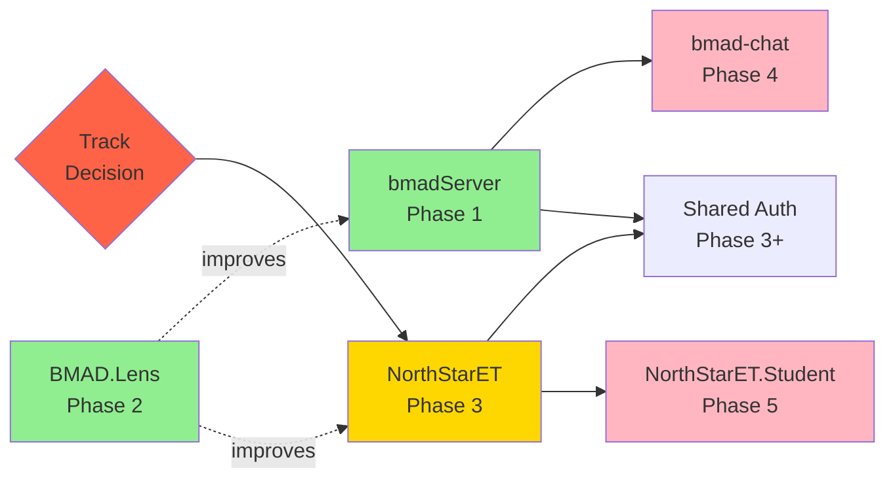

# BMAD Planning Readiness Assessment

## 1. Per-Repo Readiness Assessment

### Can BMAD `/pre-plan` start on each repo?

| Repo | Verdict | Blockers | Confidence |
|------|---------|----------|------------|
| **bmadServer** | ✅ YES — Ready Now | None critical | High |
| **BMAD.Lens** | ✅ YES — Ready Now | Minor (no CI) | High |
| **NorthStarET** | ⚠️ CONDITIONAL | Track decision required first | Medium |
| **bmad-chat** | 🔴 NOT YET | Security + integration architecture undefined | Low |
| **NorthStarET.Student** | 🔴 BLOCKED | No code; purpose undefined | N/A |
| **OldNorthStar** | ⬜ N/A | Archive — BMAD not applicable | N/A |

## 2. Detailed Readiness Per Repo

### bmadServer — ✅ READY NOW

**Readiness Score: 9/10**

| Criterion | Status | Details |
|-----------|--------|---------|
| Codebase exists and is substantial | ✅ | 297 C# files, 18.8K LOC |
| Architecture is defined | ✅ | Clean controller/service/entity separation |
| API surface is documented | ✅ | 11 controllers, 63 endpoints |
| Test coverage exists | ✅ | 87 test files + 9 BDD feature files |
| CI/CD is operational | ✅ | GitHub Actions build + test |
| No critical security issues | ✅ | JWT + BCrypt + refresh rotation |
| No blocking dependencies | ✅ | Self-contained with Aspire |
| Domain boundaries are clear | ✅ | BMAD/CHAT domain well-defined |
| Stakeholder requirements known | ⚠️ | Integration with bmad-chat needs design |
| Technical direction settled | ✅ | .NET 10 + Aspire + PostgreSQL stack confirmed |

**Recommended /pre-plan Scope:**
- **Initiative 1:** Production hardening (Redis, migration strategy, monitoring)
- **Initiative 2:** bmad-chat integration API contract design
- **Initiative 3:** Agent system expansion (beyond Mock/Copilot/OpenCode/Replay)

### BMAD.Lens — ✅ READY NOW

**Readiness Score: 8/10**

| Criterion | Status | Details |
|-----------|--------|---------|
| Codebase exists and is substantial | ✅ | 5 agents, 40 workflows, 26 prompts |
| Architecture is defined | ✅ | Module/agent/workflow/prompt hierarchy |
| "API" surface is documented | ✅ | Agent/workflow catalogs, phase commands |
| Test coverage exists | ⚠️ | Spec-based only — no automated tests |
| CI/CD is operational | 🔴 | No pipeline |
| No critical security issues | ✅ | N/A — framework has no auth |
| No blocking dependencies | ✅ | Self-contained YAML/MD/JS |
| Domain boundaries are clear | ✅ | BMAD/LENS domain well-defined |
| Stakeholder requirements known | ✅ | Framework evolution driven by control repo usage |
| Technical direction settled | ✅ | YAML + MD + JS installer confirmed |

**Recommended /pre-plan Scope:**
- **Initiative 1:** CI pipeline for YAML validation + schema checks
- **Initiative 2:** Installer automated testing
- **Initiative 3:** Next-gen agent capabilities (v4 planning)

### NorthStarET — ⚠️ CONDITIONAL

**Readiness Score: 5/10**

| Criterion | Status | Details |
|-----------|--------|---------|
| Codebase exists and is substantial | ✅ | 34K files across 3 tracks |
| Architecture is defined | ✅ | Clean Architecture (Migration), Monolith (Upgrade) |
| API surface is documented | ✅ | 50+ controllers documented |
| Test coverage exists | ⚠️ | Partial — gaps in Migration services |
| CI/CD is operational | ✅ | GitHub Actions (may need verification post-stall) |
| No critical security issues | ⚠️ | Mixed auth — custom JWT + Entra ID |
| No blocking dependencies | 🔴 | Track decision blocks scoping |
| Domain boundaries are clear | ⚠️ | Dual-track blurs boundaries |
| Stakeholder requirements known | 🔴 | Stalled — requirements need re-engagement |
| Technical direction settled | 🔴 | Migration vs. Upgrade not decided |

**Prerequisites before /pre-plan:**

1. **🔴 BLOCKER: Track Decision**
   - Choose Migration (microservices) OR Upgrade (monolith) as primary track
   - Archive or explicitly defer the non-chosen track
   - This decision MUST be made before structured planning begins

2. **🔴 BLOCKER: Restart Backlog**
   - After 20-day stall, create a triage document listing:
     - What was in progress when development stopped
     - What broke or was blocked
     - What the priorities should be going forward
   - Verify CI pipelines still pass

3. **⚠️ RECOMMENDED: AI Code Audit**
   - Review 10-15 copilot-swe-agent PRs
   - Check: test quality, edge case coverage, pattern consistency
   - Document findings as input to Analysis phase

### bmad-chat — 🔴 NOT YET READY

**Readiness Score: 2/10**

| Criterion | Status | Details |
|-----------|--------|---------|
| Codebase exists and is substantial | ✅ | 10.6K LOC TypeScript |
| Architecture is defined | ⚠️ | Spark-locked — architecture will change |
| API surface is documented | ⚠️ | Service layer exists but will be replaced |
| Test coverage exists | 🔴 | Zero tests |
| CI/CD is operational | 🔴 | No pipeline |
| No critical security issues | 🔴 | Plaintext passwords in client |
| No blocking dependencies | 🔴 | Architecture depends on bmadServer API being finalized |
| Domain boundaries are clear | ⚠️ | CHAT domain shared with bmadServer |
| Stakeholder requirements known | 🔴 | Spark vs. server integration not decided |
| Technical direction settled | 🔴 | GitHub Spark vs. standalone deployment unclear |

**Prerequisites before /pre-plan:**

1. **🔴 BLOCKER: Platform Decision**
   - Decide: remain on GitHub Spark platform OR migrate to standalone React app
   - This fundamentally changes the architecture

2. **🔴 BLOCKER: Fix Plaintext Passwords**
   - Eliminate client-side password storage BEFORE any planning begins
   - Minimum: replace with bmadServer `/api/v1/auth/login` integration

3. **🔴 BLOCKER: bmadServer Integration Architecture**
   - bmad-chat cannot be planned in isolation — it depends on bmadServer API
   - Define integration contract FIRST (REST endpoints, SignalR events, auth flow)

4. **⚠️ RECOMMENDED: Minimum Test Coverage**
   - At least: service layer unit tests + 1-2 critical path E2E tests
   - Cannot validate changes safely without tests

### NorthStarET.Student — 🔴 BLOCKED

**Readiness Score: 0/10**

| Criterion | Status | Details |
|-----------|--------|---------|
| Application code exists | 🔴 | Zero code — only BMAD framework boilerplate |
| Purpose is defined | 🔴 | Relationship to NorthStarET Student service unclear |
| Architecture is defined | 🔴 | No technology decisions made |
| Requirements are known | 🔴 | No product requirements |

**Prerequisites before /pre-plan:**

1. 🔴 Decision: What does this repo contain that NorthStarET doesn't?
2. 🔴 Decision: Separate deployment or merged into NorthStarET?
3. 🔴 Decision: Keep, defer, or archive?

### OldNorthStar — ⬜ NOT APPLICABLE

BMAD lifecycle does not apply to archive repositories. OldNorthStar is consumed as input during NorthStarET planning phases.

## 3. Recommended Initiative Sequencing

### Optimal Planning Order

```
Phase 1: bmadServer (READY NOW)
    ├── Initiative: Production Hardening
    ├── Initiative: bmad-chat Integration Contract
    └── Duration: 1-2 sprints
    
Phase 2: BMAD.Lens (READY NOW, lower priority)
    ├── Initiative: CI Pipeline + Testing
    └── Duration: 1 sprint

Phase 3: NorthStarET (AFTER track decision)
    ├── Prerequisite: Track decision + restart backlog
    ├── Initiative: Chosen Track Completion
    ├── Initiative: Missing Test Coverage
    └── Duration: 3-5 sprints

Phase 4: bmad-chat (AFTER bmadServer integration contract)
    ├── Prerequisite: bmadServer API stable + integration contract defined
    ├── Initiative: Spark → bmadServer Migration
    ├── Initiative: Test Coverage
    └── Duration: 2-3 sprints

Phase 5: NorthStarET.Student (IF decided to proceed)
    ├── Prerequisite: NorthStarET track decision + Student service scoping
    └── Duration: TBD
```

### Why This Order?

1. **bmadServer first:** Highest readiness, defines API contract that bmad-chat depends on
2. **BMAD.Lens second:** Ready now, low effort, improves framework reliability
3. **NorthStarET third:** Largest codebase, most complex, but needs triage decisions first
4. **bmad-chat fourth:** Cannot be planned until bmadServer API is stable
5. **NorthStarET.Student last:** Depends on NorthStarET decisions and has no code

## 4. Cross-Repo Dependency Constraints for Planning

### Hard Dependencies (Cannot Plan Out of Order)

```
bmad-chat DEPENDS ON bmadServer API contract
    → bmadServer must complete integration contract design BEFORE
      bmad-chat can enter /pre-plan

NorthStarET DEPENDS ON track decision
    → Cannot scope /pre-plan without knowing Migration vs. Upgrade

NorthStarET.Student DEPENDS ON NorthStarET
    → Cannot define purpose without NorthStarET Student service finalized
```

### Soft Dependencies (Beneficial but Not Blocking)

```
BMAD.Lens CI → benefits all repos (framework reliability)
    → Nice to have before NorthStarET planning, but not blocking

Shared auth package → benefits bmadServer + NorthStarET
    → Can be planned as a cross-repo initiative after both are stable

NorthStarET AI audit → benefits NorthStarET planning quality
    → Should happen before /pre-plan but could be parallel
```

### Dependency Diagram



## 5. Planning Dashboard Summary

### Overall Portfolio BMAD Readiness: 🟡 AMBER

| Metric | Value |
|--------|-------|
| **Repos ready for /pre-plan** | 2 of 6 (bmadServer, BMAD.Lens) |
| **Repos conditionally ready** | 1 (NorthStarET — needs track decision) |
| **Repos blocked** | 2 (bmad-chat, NorthStarET.Student) |
| **Repos N/A** | 1 (OldNorthStar — archive) |
| **Critical blockers** | 3 (plaintext passwords, track decision, no integration) |
| **Estimated time to full readiness** | 4-6 weeks (if decisions are made promptly) |

### Immediate Next Steps

1. **START NOW:** Begin BMAD `/pre-plan` on **bmadServer** — define production hardening initiative
2. **START NOW:** Begin BMAD `/pre-plan` on **BMAD.Lens** — define CI + testing initiative
3. **DECIDE:** NorthStarET track decision (Migration vs. Upgrade) — unblocks planning
4. **DECIDE:** bmad-chat platform decision (Spark vs. standalone) — unblocks planning
5. **DECIDE:** NorthStarET.Student status (keep, defer, archive) — resource clarity

---

*Generated by Scout (GD workflow) — LENS Workbench*
